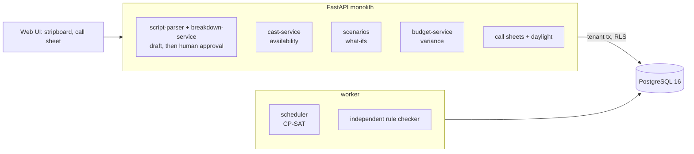

# AI Film Production Planning System

Pre-production in one place: it reads a screenplay into scenes, cast and locations, has a person approve that breakdown, then
solves for a shooting schedule that respects availability, daylight, night-shoot turnaround and day length at the lowest cost it
can find, re-plans around a disruption while moving as little as possible, and prints the call sheet.

Built from blueprint 9 of "Advanced Project Blueprints, Volume II" as a **vertical slice**: the demo scenario end to end, with the
platform parts real and the rest listed under [Not built](#not-built-and-why).

**The screenplay is generated nonsense in correct standard format. Rates, fees and working rules are assumptions, not any union agreement. Schedules are the best found in a few seconds, not proven cheapest.**

## Run it

```bash
docker compose up --build        # migrates, seeds, serves http://localhost:8209/ui/ with one worker
docker compose run --rm test     # 34 tests against a throwaway database (about 40 s: several solves)
```

Open http://localhost:8209/ui/ and press **Run all steps** (two solves of 12 seconds each), or `make bootstrap demo`.
Demo tokens (local only): `studio-producer-demo`, `studio-assistant_director-demo`, `studio-crew-demo`. Run `make reset` before a second demo run.

## The demo, step by step

1. A 132-page screenplay is parsed: 85 scenes (49 interior, 36 exterior, 23 at night), 12 cast, 14 locations, about 156 hours of shooting. 26 scenes carry a note for the reviewer, mostly performers heard only in voice-over. A producer approves the breakdown.
2. Plan A: 17 shoot days for $1.33M, against 19 days and $1.64M in script order (19% less). It is $26k over the $1.30M budget, and says so. Every rule is re-checked by separate code: 0 violations.
3. The call sheet for day one: four scenes in shooting order, crew call 07:00, wrap 17:28, sunrise 06:43 and sunset 17:16, each performer's call.
4. The lead loses three days and rain is forecast on two. Plan B, solved to stay close to Plan A: 12 scenes had to move, 35 moved in all, no exterior left on a rain day, still 17 days, $40k more.
5. Budget variance, line by line: most of the extra is overtime (+$30k); Plan B is $66k over budget.
6. Plan C makes the lead unavailable for the whole shoot: refused before the solver runs, with the reason; Plans A and B are untouched.
7. The audit log.

## Architecture



| Piece | How it works |
|---|---|
| Parser | Rules for standard format. A scene heading opens a scene. A performer is on set if they have a cue that is not voice-over (off-screen still counts), or if a known character's name appears in an action line (longest names first, so YOUNG MARA is not also MARA; the heading itself is skipped, so MARA'S APARTMENT does not call Mara). A name spoken in dialogue is not a person on set. Pages are lines / 55, in eighths. |
| Approval gate | A parsed breakdown is a draft. Scheduling is refused until someone with the producer role approves it. |
| Time per scene | Pages x 55 minutes (interior) or 70 (exterior), plus 15 minutes of setup. |
| Scheduler | CP-SAT: one boolean per (scene, day). Rules: at most 12 hours a day (over 10 is paid overtime), at most two locations a day, a day is all-day or all-night, no day call on the calendar day after a night shoot, exterior day work must fit daylight less an hour, nobody is scheduled on a day they are unavailable. |
| Cost | Crew per shoot day; each performer from first work day to last (idle days included); a fee per location per day; a charge per company move; overtime per minute; expected rain cost for exteriors on days with a rain chance. |
| Staying close | When a scenario is based on another, moving a scene off its earlier day carries a penalty in the solve (not in the reported cost). |
| Checker | `violations()` re-checks every rule on the solver's answer in separate code; a schedule that fails is never stored. |
| Call sheet | Scenes grouped by location, calls an hour before a performer's first scene, sunrise and sunset from the solar declination formula. |
| Platform | Row-level security per studio, Postgres job queue, Idempotency-Key replay, hash-chained audit log, `/metrics`. |

## Data model

`migrations/002_production.sql` follows the blueprint (productions, scenes, cast, scene_cast, shoot_days, schedule_items,
cost_items); additions are marked `(+)`: locations, scenarios, the breakdown status, and `scenario_id` on shoot days.

## API

| Method | Endpoint | Purpose |
|---|---|---|
| POST | `/v1/scripts/parse` | Screenplay text to a draft breakdown |
| POST | `/v1/schedules/optimize` | 202 + job: solve a scenario |
| POST | `/v1/scenarios` | A what-if with its own availability and weather, optionally based on another |
| GET | `/v1/budget/variance` | Cost by line against the budget and against another scenario |
| POST | `/v1/availability` | Standing unavailable dates for a cast member |
| GET | `/v1/call-sheets/{date}` | The call sheet for a shoot date |
| POST | `/v1/productions/{id}/breakdown:approve` | (+) The human approval that unlocks scheduling |
| GET | `/v1/schedules/{scenario_id}` | (+) The stripboard |

Contract: [`docs/openapi.json`](docs/openapi.json).

## Measured

[`docs/evaluation.md`](docs/evaluation.md) (`python -m fp.evaluate`, four screenplays the demo never uses) and [`docs/performance.md`](docs/performance.md).

| Component | Result | Baseline |
|---|---|---|
| Scenes with exactly the right cast | 340 of 340 | every cue in the scene: 204 of 340 |
| Schedule cost, 12 s of solving | $1.11M to $1.29M (14 to 16 days) | script order: $1.57M to $1.77M (19 to 21 days); 26% to 30% less |
| Proven lower bound | about half the cost found | |
| Re-plan after a disruption: scenes moved | 30 to 52 of 85 | solving from scratch: 78 to 85 |
| Re-plan cost | within 4% of solving from scratch | |

Perfect parsing reflects a perfectly formatted script. And no schedule here is proven optimal: the solver's lower bound is far
below its answer, so the honest claim is "much cheaper than script order", not "cheapest".

## The hardest tradeoff

Cheapest against least disruptive. After the lead loses three days, solving from scratch reshuffles nearly the whole film (78 to
85 of 85 scenes moved) for a cost that is sometimes a little lower and sometimes higher. Every moved scene is a location rebooked,
a crew notified and other actors' weeks rearranged, and none of that is in the cost model. So a re-plan charges $3,000 inside the
solve for each scene that leaves its earlier day. That keeps 33 to 55 scenes where they were, at a reported cost within 4% of the
fresh solve. It still moves three to six times the minimum, because a moved scene usually displaces another. The $3,000 is a
judgement, and it is the one number here I would most want a real assistant director to set.

## Threat model (summary)

| Threat | Mitigation here | Gap |
|---|---|---|
| Scheduling from a wrong breakdown | Parsing produces a draft with reviewer notes; a different role must approve before any solve (tested) | Approval is all-or-nothing: no per-scene edit of the breakdown |
| A schedule that breaks a working rule | Rules are solver constraints and are re-checked by separate code before storing; tests re-check the stored schedules | The rules are generic stand-ins, not a real agreement |
| One studio seeing another's script, rates or schedule | Row-level security on every table; tested with a second studio | |
| Crew seeing cast rates | Budget endpoints need a permission the crew role lacks (tested) | The stripboard is visible to all roles in the studio |
| A what-if overwriting the live plan | Each scenario owns its shoot days and costs; solving one cannot touch another (tested) | |
| Untrusted script text | Parsed with anchored patterns, size-limited, never executed or sent anywhere | |

## Not built, and why

- **Real screenplays and PDF / Final Draft import**: a generated script stands in, so the parser has an answer key.
- **A language model for the breakdown** (props, stunts, vehicles, special equipment): only scenes, cast, locations and pages are extracted.
- **Duration and cost estimation from history**: minutes per page and all rates are fixed assumptions.
- **Real working rules**: meal breaks, sixth-day and seventh-day rules, minors' hours, travel days and holding pay are not modelled.
- **Weather and travel data**: rain chances are typed into a scenario; there is no forecast feed or travel-time matrix. Daylight is geometric (no refraction, no clock time or daylight saving).
- **Crew and equipment as resources, a vendor marketplace, real-time collaboration**: not started.
- **Kafka, Redis, OpenTelemetry, Grafana, MLflow, Terraform, CI, SSO, a Next.js front end**: not needed to prove the slice; no cloud account used.

## Commercial sketch

Buyer: independent productions, studios, line producers. Pricing shape from the blueprint: per production, a studio plan, the
schedule optimiser as an add-on.

## Layout

```
core/        platform kit: db + RLS, jobs, audit chain, HTTP, scenario runner, load test
fp/          world (generated screenplay), engine (parser, rules, CP-SAT scheduler, costing, call sheet, daylight), api, seed, evaluate
migrations/  forward-only SQL          web/   UI, scenario.json, demo.json (recorded run)
tests/       34 tests                  docs/  evaluation.md, performance.md, openapi.json
```
